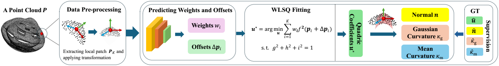

# OscuFit

OscuFit: Learning to Fit Osculating Implicit Quadrics for Point Clouds. 

<div align="center">
  
</div>


### Data Preparation
Please download the pre-processed [ABC-Diff dataset](https://drive.google.com/file/d/1sN2rFiyHaHRYWlkZcTOx6OZzNpI08tYt/view?usp=sharing).

unzip the dataset and put it in the data folder, or modify the data root path in the `options.py`

### Training
configure your training settings in `options.py`, and then:

```python train.py```

### Testing
configure your testing settings in `options.py`, and then:

```python test.py```
