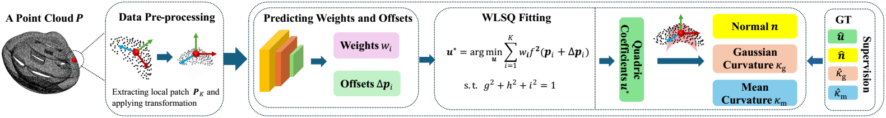

# OscuFit

OscuFit: Learning to Fit Osculating Implicit Quadrics for Point Clouds  ([AAAI-2026](https://ojs.aaai.org/index.php/AAAI/article/view/37405)). 

<div align="center">
  
</div>


### Data Preparation
Please download the pre-processed [ABC-Diff dataset](https://drive.google.com/file/d/1sN2rFiyHaHRYWlkZcTOx6OZzNpI08tYt/view?usp=sharing).

unzip the dataset and put it in the data folder, or modify the data root path.

### Training

```python train.py```

### Testing

```python test.py```

